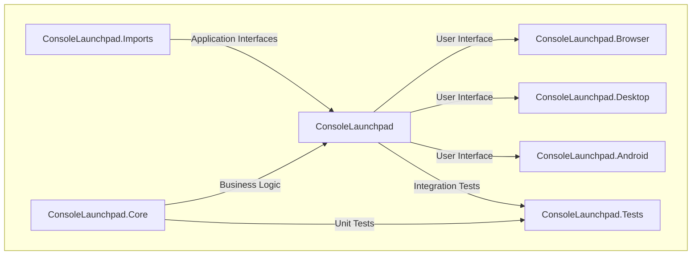

<h1 align="center"><strong><em>ConsoleLaunchpad</em> 🕹️</strong></h1>
<a href="https://github.com/dylanlangston/consolelaunchpad/" title="ConsoleLaunchpad 🕹️">
  <p align="center">
    </img>
  </p>
</a>
<p align="center">
  <strong>An (unofficial) AWS Console Federated Sign-In Tool</strong>
</p>

<p align="center">
  <a href="https://dotnet.microsoft.com/"></a>
  <a href="https://www.avaloniaui.net/"></a>
  <a href="https://github.com/dylanlangston/ConsoleLaunchpad/actions/workflows/build.yml"></a>
  <a href="https://github.com/dylanlangston/ConsoleLaunchpad/blob/main/LICENSE"></a>
  <a href="https://github.com/dylanlangston/ConsoleLaunchpad/releases/latest"></a>
  <a href="https://api.github.com/repos/dylanlangston/ConsoleLaunchpad"></a>
</p>

### Overview 👀
This tool simplifies access to the AWS Console by leveraging the [GetFederationToken](https://docs.aws.amazon.com/STS/latest/APIReference/API_GetFederationToken.html) API, allowing users to sign in swiftly and securely using their local AWS credentials. It caters to individuals who need frequent access to the AWS Console without constantly requiring them to enter their 2-Factor Authentication (2FA) details. Built with [C#](https://dotnet.microsoft.com/) and [Avalonia](https://www.avaloniaui.net/) to ensure a consistent expierence across different platforms while still using a single unified codebase. This is a community effort and not affiliated with Amazon/AWS, if you're having any problems please open an [issue](#support).

### Features ✨
- [x] 🔑 **Efficient Sign-In**: Streamlines the sign-in process to the AWS Console by utilizing the GetFederationToken API.
- [x] 🛡️ **Effective Security**: Offers a reasonably secure sign-in method without necessitating 2FA, suitable for users requiring regular access to the AWS Console.
- [x] 🌐 **Cross-Platform Compatibility**: Single codebase can be built for Desktop, Web, and Mobile.
- [x] 🎨 **User-Friendly Interface**: Intuitive UI design facilitates easy navigation and usage for both novice and experienced users.

### Demo 🎬
`Demo gif showcasing functionality coming soon...`

### Usage ⏯️
`Detailed usage instructions coming soon...`

### Building 🏗️
`Build instructions coming soon...`

### Dev Environment 💻
<table>
  <tr>
    <td colspan="6">
      This repository offers a streamlined development environment setup using a <a href=".devcontainer/devcontainer.json"><code>devcontainer.json</code></a> file, allowing you to get up and running quickly with a fully-featured environment in the cloud.<sup><a href="#local-development" id="fnref-local-development">[1]</a></sup> Use one of the following links to get started:
    </td>
  </tr>
  <tr>
    <td colspan="2">
      <p align="center">
        <a href="https://codespaces.new/dylanlangston/ConsoleLaunchpad"></a>
      </p>
    </td>
    <td colspan="2">
      <p align="center">
        <a href="https://vscode.dev/redirect?url=vscode://ms-vscode-remote.remote-containers/cloneInVolume?url=https://github.com/dylanlangston/ConsoleLaunchpad"></a>
      </p>
    </td>
    <td colspan="2">
      <p align="center">
        <a href="https://devpod.sh/open#https://github.com/dylanlangston/ConsoleLaunchpad"></a>
      </p>
    </td>
  </tr>
  <tr>
    <td colspan="6">
      If you want to browse the source code without the need to build, you can do so conveniently on GitHub.dev or VSCode.dev:
    </td>
  </tr>
  <tr>
    <td colspan="3">
      <p align="center">
        <a href="https://github.dev/dylanlangston/ConsoleLaunchpad"></a>
      </p>
    </td>
    <td colspan="3">
      <p align="center">
        <a href="https://vscode.dev/github/dylanlangston/ConsoleLaunchpad"></a>
      </p>
    </td>
  </tr>
</table>
</p>

### Solution Architecture 🏰


### Minimal Implementation 🛠️
For anyone asking "how does this all works", here's a minimal implementation in C#:
```csharp
using System;
using Amazon.IdentityManagement;
using Amazon.IdentityManagement.Model;
using Amazon.Runtime;
using Amazon.Runtime.CredentialManagement;
using Amazon.SecurityToken;
using Amazon.SecurityToken.Model;

class Program
{
    static async Task Main()
    {
        string policy = @"{
            ""Statement"": [{
                ""Effect"": ""Allow"",
                ""Action"": ""*"",
                ""Resource"": ""*""
            }]
        }"; // Your desired policy

        AWSCredentials credentials;
        CredentialProfileStoreChain chain = new CredentialProfileStoreChain();
        if (chain.TryGetAWSCredentials("profile_name", out credentials)) // Your AWS profile name
        {
            Console.WriteLine("Using local AWS profile credentials.");
        }
        else
        {
            credentials = new BasicAWSCredentials("YOUR_ACCESS_KEY_ID", "YOUR_SECRET_ACCESS_KEY"); // Your AWS credentials
        }

        using (var stsClient = new AmazonSecurityTokenServiceClient(credentials, Amazon.RegionEndpoint.USEast1)) // Replace the region if desired
        {
            GetFederationTokenRequest getTokenRequest = new()
            {
                Name = "Username",
                Policy = policy,
                DurationSeconds = 3600 // Set the duration for which the temporary credentials are valid
            };

            GetFederationTokenResponse getTokenResponse = await stsClient.GetFederationTokenAsync(getTokenRequest);

            string sessionToken = getTokenResponse.Credentials.SessionToken;
            string consoleSigninLink = $"https://signin.aws.amazon.com/federation?Action=login&Issuer=ExampleCorp&Destination=https%3A%2F%2Fconsole.aws.amazon.com%2F&SigninToken={Uri.EscapeDataString(sessionToken)}";

            Console.WriteLine($"Signed URL for AWS Console: {consoleSigninLink}");
        }
    }
}
```

### Resources ℹ️
Here are some additional resources regarding the GetFederationToken API and its usage:
<table>
  <tr>
    <td><a href="https://docs.aws.amazon.com/IAM/latest/UserGuide/id_roles_common-scenarios_federated-users.html#id_roles_common-scenarios_federated-users-idbroker">AWS IAM User Guide - Federated Users</a></td>
  </tr>
  <tr>
    <td><a href="https://docs.aws.amazon.com/IAM/latest/UserGuide/id_credentials_temp_request.html#api_getfederationtoken">AWS IAM User Guide - GetFederationToken</a></td>
  </tr>
  <tr>
    <td><a href="https://docs.aws.amazon.com/STS/latest/APIReference/API_GetFederationToken.html">AWS STS API Reference</a></td>
  </tr>
  <tr>
    <td><a href="https://docs.aws.amazon.com/sdkfornet/v3/apidocs/items/SecurityToken/TGetFederationTokenRequest.html">AWS SDK for .NET API Docs</a></td>
  </tr>
</table>


### Contributions 🙌
Contributions to this project are welcome! Feel free to submit bug reports, feature requests, or pull requests via [GitHub](https://github.com/dylanlangston/consolelaunchpad).

### License 📜
This tool is licensed under the [MIT License](https://opensource.org/licenses/MIT). See the [`LICENSE`](https://github.com/dylanlangston/consolelaunchpad/blob/main/LICENSE) file for details.

### Support 🆘
For any inquiries or assistance, please open an [issue](https://github.com/dylanlangston/consolelaunchpad/issues/new/choose).

<h2 id="footer"></h2>
<sub>
<section>
  <ol dir="auto">
    <li id="local-development">
    <p>For local development check out <a href="https://marketplace.visualstudio.com/items?itemName=ms-vscode-remote.remote-containers">Dev Containers</a> and <a href="https://devpod.sh/">DevPod</a>. <a href="#fnref-local-development" aria-label="Back to reference 1">↩</a></p>
    </li>
  </ol>
</section>
</sub>
